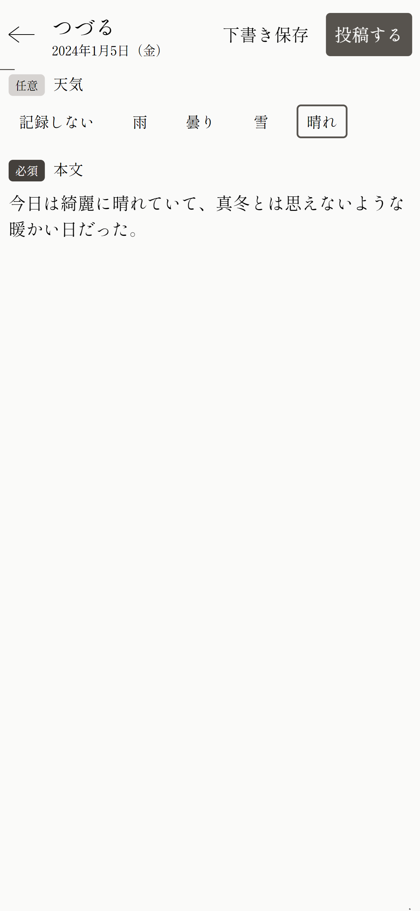
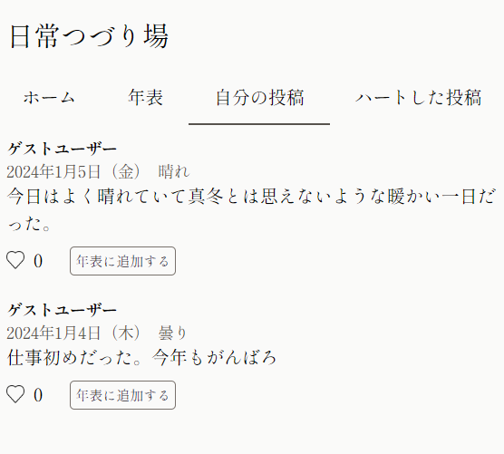
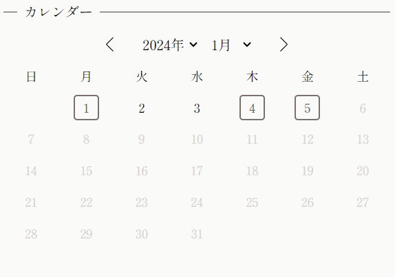
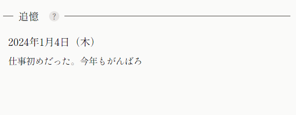
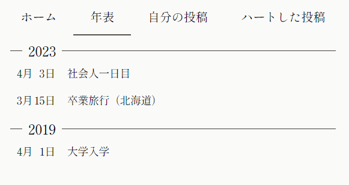
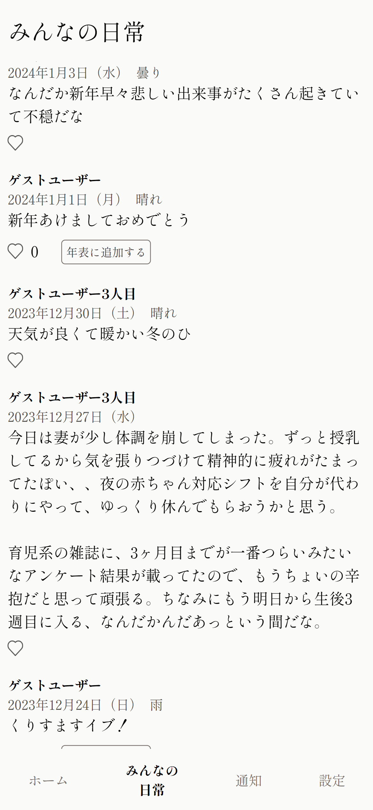

+++
title = '無料日記サービス「日常つづり場」とは'
description = '無料日記サービス「日常つづり場」で出来ることを説明します。'
date = 2024-01-05T10:39:38+09:00
draft = false
+++

日常つづり場に興味を持っていただいてありがとうございます。  
この記事では「日常つづり場」とはどういうもので、何が出来るのかについてご説明します。

とりあえず使ってみたい、という方はアカウント登録することなくブラウザですぐ利用できますので、ぜひ[こちら](https://tuzuriba.com/signin/guest)からお試しください。

スマホアプリとしてインストールすることもできます。[こちら](https://media.tuzuriba.com/news/20231210_pwa_release/)をご覧ください。

## コンセプト
サービスのメインページ（[https://lp.tuzuriba.com/](https://lp.tuzuriba.com/)）に記載しているものをそのまま引用しますが、コンセプトは下記です。

> 日常を日記のようにつづり、今同じ時間を生きている人たちと共有する場所です。
> 
> 「日常」が続いたものが結果的にあなたの人生となります。
> そんな人生の大切な一部を言葉にして残してみませんか？
>
> 周りの目、 評価、 表向きの姿
> などを気にすることなく
> ありのままに今日起きたことや感情をつづることができます。
> あなたの日常に誰かが共感してくれたり、
> 将来自分の日常を見返して「こんなこともあったな」と振り返られるかもしれません。
>
> また、他の人の日常を見て
> 「同じように頑張っている人がいるんだ」
> と共感したり、
> 「こう考えている人もいるんだ」と新しい考えを知ることができたるかもしれません。
>
> 日常つづり場は、このように色々な人の人生がゆるやかに行き交う場を目指しています。

## 出来ること
日常つづり場で主にできることは下記のとおりです。

### ◇日常をつづる
一日につき一回だけ日常をつづることができます。1000文字までで、画像や動画などほかのメディアは投稿できません。

### ◇日常を振り返る
色々な方法で日常を振り返ることができます。

時系列順で過去を振り返ったり、

カレンダーから振り返ったり、

「追憶」機能で、ランダムで過去の一日に思いを馳せてみたりできます。

### ◇大切な日を年表に記録する
日頃つづった内容を「年表に追加」することで、自分史のような年表を作成することができます。

旅行に行った日や、大切な人に会った日、辛いけど転機になるような日、など大きな出来事があった日を年表に追加することで後でそれらの日を振り返りやすくなります。

### ◇他ユーザーの日常を見る
今同じ時間を生きている人たちのそれぞれの日常を見ることができます。

### ◇「ハート」をする/される
他のユーザーの日常に対して「ハート」をすることで出来ます。共感したときや良いと思った時などに、その思いを伝えることができます。  
もちろん、他ユーザーが自分の日常に対してハートをすることもでき、誰がハートをしてくれたのかを見ることもできます。

以上の他にも、投稿の下書き機能やダークモード・テーマの設定など、普段から心地よく使っていただけるような機能があります。  
アカウント登録することなくブラウザですぐ利用できますので、ぜひ[こちら](https://tuzuriba.com/signin/guest)からお試しください！
