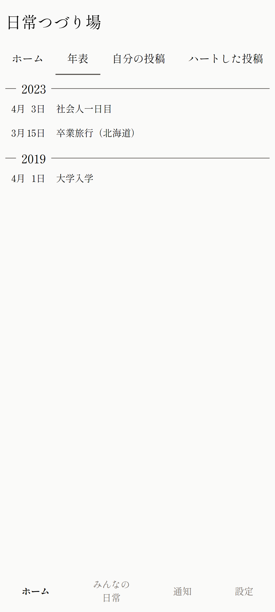
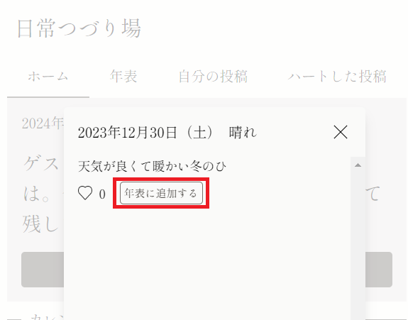
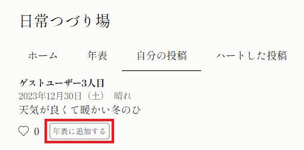
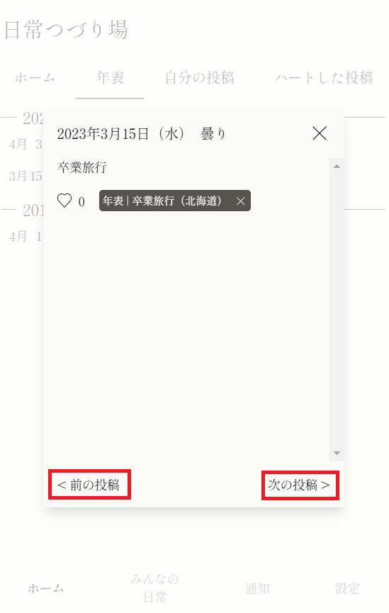

+++
title = '"年表"機能を追加しました'
description = '"年表"機能を追加しました。大切な日を振り返りやすくなります。'
date = 2024-01-04T15:59:43+09:00
draft = false
+++

いつも日常つづり場をご利用いただきありがとうございます。

掲題の通り"年表"機能を追加しました。  
日頃つづった内容を「年表に追加」することで、自分史のような年表を作成することができます。

旅行に行った日や、大切な人に会った日、辛いけど転機になるような日、など大きな出来事があった日を年表に追加することで後でそれらの日を振り返りやすくなります。

なお、年表は投稿と同様に他ユーザー様（ゲストユーザー以外）も見ることができます。

年表への追加は、カレンダーで日付をタップして表示される投稿モーダルか、「自分の投稿」ページから行うことができます。

本機能の追加に伴い、付随して下記の機能変更があります。
- 過去日付の投稿ができるようになりました。  
カレンダーで未投稿の過去日付をタップすると、その日付の投稿をすることができます。
- 投稿モーダルから次の投稿・前の投稿に移動できるようになりました。  
とある日の投稿の前後の投稿を確認しやすくなります。  
