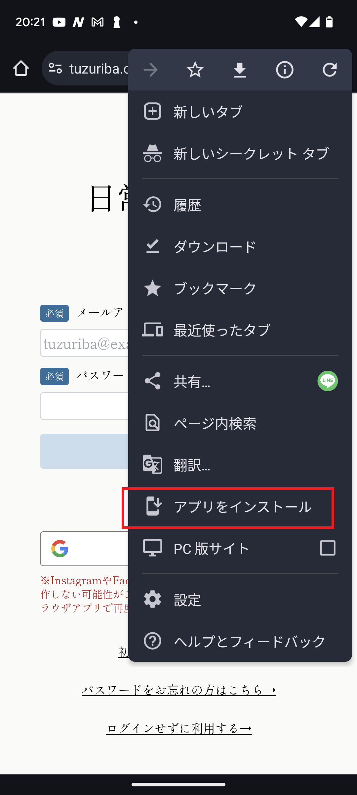

+++
title = 'スマホアプリとしてインストールできるようになりました'
description = '日常つづり場がスマホアプリのようにインストールできるようになりました。通常のアプリのようにホーム画面のアイコンから日常つづり場が開けるようになります。'
date = 2023-12-10T16:26:44+09:00
draft = true
+++
いつも日常つづり場をご利用いただきありがとうございます。

掲題の通り日常つづり場をスマートフォンにアプリとしてインストールし、ホーム画面から開くことができるようになりました。  
一般的なアプリとは異なり、PWAという新しい技術を利用したアプリとなっており、ご利用のブラウザ（SafariやGoogle Chrome）から直接インストールをすることができます。

※参考）[PWAとは](https://www.ntt-west.co.jp/business/glossary/words-00193.html)

## インストール手順
### iPhoneの場合
1. ブラウザで[日常つづり場](https://tuzuriba.com)を開き、共有ボタン（四角に上向きの矢印が書いてあるボタン）をクリックします。
  
2. 「ホーム画面に追加」ボタンをクリックします。
  
3. 「追加」ボタンをクリックします。
  
4. ホーム画面に日常つづり場のアイコンが作成されます。

※iPhoneの場合、ブラウザでのログイン状況がアプリに反映されませんので、アプリを開いた後再度ログインいただく必要がございます。

### Androidの場合
1. ブラウザで[日常つづり場](https://tuzuriba.com)を開きます。  
  ※場合のよってはこの時点で「インストールする」というポップアップが出る場合がございます。その場合そのボタンを押せばインストールされます。
2. 右上の三つの点のボタンをクリックします。
  
3. 「アプリをインストール」ボタンをクリックします。
  
4. 「インストール」ボタンをクリックします。
  
5. ホーム画面に日常つづり場のアイコンが作成され、アプリとして開くことができるようになります。
