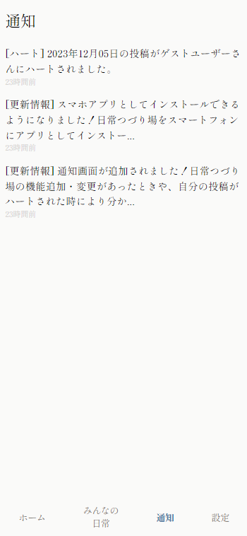
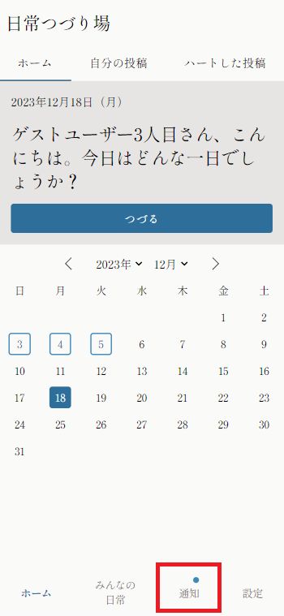

+++
title = '通知機能が追加されました'
description = '通知機能が追加されました。日常つづり場からのお知らせがあったときや、自分の投稿がハートされた時により分かりやすくなりました。'
date = 2023-12-17T10:49:45+09:00
draft = false
+++
いつも日常つづり場をご利用いただきありがとうございます。  
掲題の通り、通知機能が追加されました。

日常つづり場からのお知らせがあったときや、自分の投稿がハートされたときにより分かりやすくなりました。  
下のメニューバーの「通知」ボタンをクリックすると通知一覧を見ることができます。

また、未読の通知がある場合は「通知」ボタンの右上に青い丸がつくようになっていますので、新たな通知が来た時に一目でわかります。

