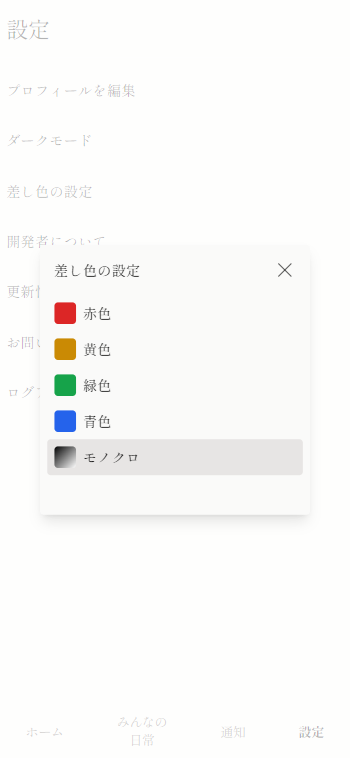

+++
title = '差し色が選べるようになりました'
description = '差し色が選べるようになりました！これまでは青色固定でしたが、他に黄色、赤色、緑色、モノクロが選択できるようになりました。'
date = 2023-12-19T20:50:32+09:00
draft = false
+++

いつも日常つづり場をご利用いただきありがとうございます。

掲題の通り差し色が選択できるようになりました。  
これまでは青色固定でしたが、他に黄色、赤色、緑色、モノクロが選択できるようになりました。

ダークモードと併せて、気分や天気、時間帯などによって見た目を変えてお楽しみください！

設定画面の「差し色の設定」から選択できます。

画面に差し色の設定が表示されない場合、再読み込みをしてみてください。
