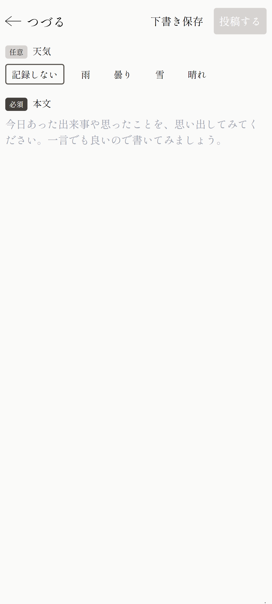

+++
title = '天気を記録できるようになりました'
description = '天気を記録できるようになりました。'
date = 2023-12-30T16:17:06+09:00
draft = false
+++
日常を投稿するときに、一緒に天気を記録できるようになりました。

ある日を思い出すときに、意外と空模様は大きな要素だったりするのではないかと思います。

良かったら一緒に記録してみてください！