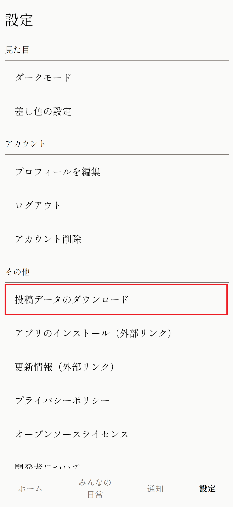

+++
title = '投稿がCSV形式でダウンロードできるようになりました'
description = '投稿がCSV形式でダウンロードできるようになりました。バックアップ等にご活用ください。'
date = 2024-01-22T12:58:21+09:00
draft = false
+++
いつも日常つづり場をご利用いただきありがとうございます。

掲題の通り、自分のこれまでの投稿をCSV形式でダウンロードできるようになりました。  
バックアップ等にご活用ください。

ダウンロードは設定画面から行うことができます。

ダウンロードしたCSVファイルはMicrosoft ExcelやGoogleスプレッドシート等の表計算ソフトで開くことができます。

ファイルは「Shift_JIS」という形式でエンコーディングされており大抵の場合は文字化けせずにひらけますが、ご利用のOSや表計算ソフトウェアの種類によっては文字化けしてしまう可能性があります。

その場合、「OS ソフトウェア名　Shift_JIS」で検索をしてみてください。（例：MacOS Numbers Shift_JIS）  
文字化けを回避してファイルを開く方法が見つかるかと思います。

